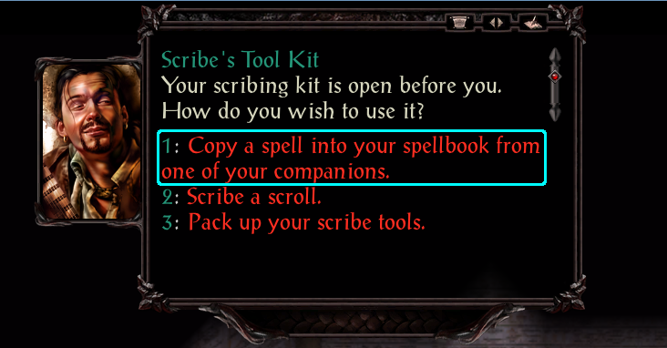

# Copy Spells
This component will allow any spellbook-based caster to copy spells from another spellbook-based caster;
that would be bards and wizards in 2E. Spells' exclusion flags are honored, so Bards shouldn't get wild mage spells,
and opposition schools should not be copyable to forbidden kits.

This component _should_ honor the spell levels of each class; Bards can copy level 6 or lower spells from Mages, and Mages can copy
level 6 or lower spells from Bards, level 10 or less from other Mages.

Sorcerers cannot copy spells, since they use magic innately.

Spells to not need to be memorized; they only need to be in a party member's spellbook to be copied.

## Costs for copying spells
Cost for copying spells is as follows:

| Level | Gold | Hours |
| ----- | ---- | ----- |
| 1     |  25  | 1     |
| 2     |  50  | 2     |
| 3     |  75  | 3     |
| 4     | 125  | 4     |
| 5     | 250  | 8     |
| 6     | 500  | 12    |
| 7     | 750  | 24    |
| 8     |1000  | 48    |
| 9     |1250  | 72    |
| 10    |5000  | 144   |

## Process
1. Purchase scribing tools from a spell shop.
1. Identify the item
1. Begin dialog with the scribe tools
1. Select the option to copy spells:
   
1. Select the party member to copy arcane spells from:
   
1. Select the circle of spell to copy from:
   
1. Select which spell to copy:
   
1. Confirm you want to spend time and gold to copy the spell:
   
1. Watch the small cutscene similar to Cespenar and Cromwell
