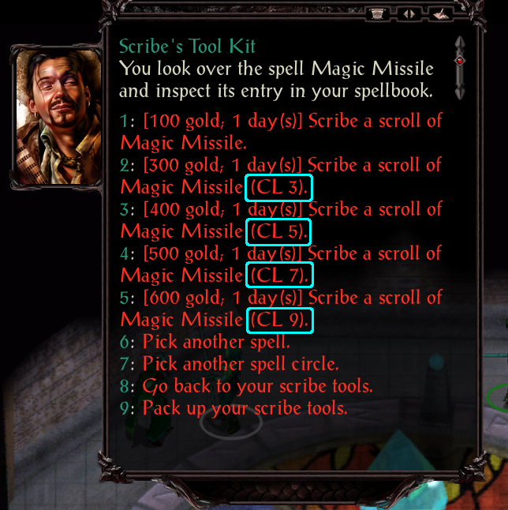

# Leveled Scrolls
This component generates scrolls from existing spells that are leveled (have slightly different effects based off of level),
up to level 50. This component does not add anything to stores, just installs the new assets.

## Why bother?
There can be a big difference between Magic Missile at level 1 and at level 9. Keeping scrolls around for this spell in-game really feels
pointless in the base game, but being able to go into a dragon fight with 15 such max-level scrolls makes a lot more sense.

## Distinction
Since the effects of the scrolls differ, each leveled scroll requires a different `*.itm` file. This prevents scrolls of different levels from stacking.
To distinguish scrolls, I have added a suffix to each generated scroll indicating its caster level: `, CL 20`

It would feel jarring to have 10 different versions of the same spell scroll icon in-game with nothing to distinguish them but hovering over the item
to see its name

## Item Codes
These scrolls are dynamic, so I cannot tell you which items will exist until after installation. Some mods change spells and at which level their
effects occur, or rate, or introduce new leveled effects where none previously existed. If the spell has abilities past minimum caster level, this mod
should detect them and attempt to create a new scroll item with that leveled effect.

## Cost
This is somewhat complicated. Since AD&D 2E had very little pricing guidance (unlike D&D 3E), I had to take a wild stab at it. Costs landed where they
"feel" about right. The equation for calculating the leveled scroll cost is:

`base scroll level cost` + (`Excess Caster Level` * 50 * `Spell level`)
where:
- `base scroll level cost` is the cost within the `*.itm` file of the base scroll for the spell at minimum caster level.
- `Excess Caster Level` is the number of levels past the minimum caster level.
    - e.g.: Magic Missile has a minimum caster level of 1; a level 9 version would have `Excess Caster Level` of (9 - 1) = 8
    - e.g.: Fireball has a minimum caster level of 5; a level 12 version would have `Excess Caster Level` of (12 - 5) = 7
- `Spell level` is the spell's level within a spellbook.
    - e.g.: Magic Missile is a level 1 spell
    - e.g.: Fireball is a level 3 spell

## Process
The process for crafting a leveled scroll is identical to that of a regular scroll; it should simply display all scroll options when you go to craft a scroll:

